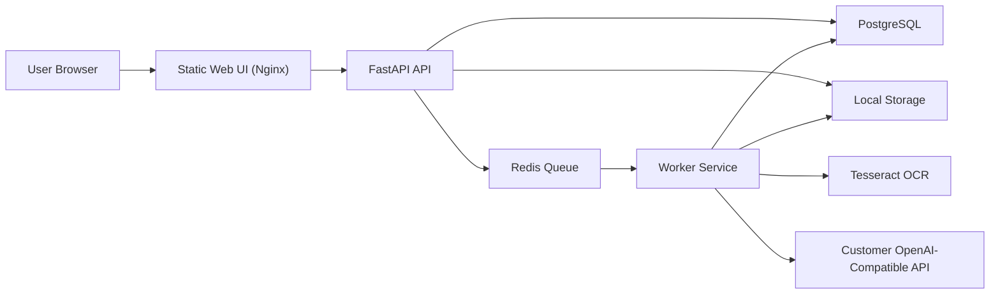

# Architecture

## Overview

Doc Translator uses a split deployment with a static web UI, a FastAPI API service, a worker service, PostgreSQL, Redis, and customer-controlled file storage.

## Components

### Web

- Single-page operational UI served by Nginx
- Proxies `/api/*` requests to the API container
- Keeps frontend deployment simple for intranet environments

### API

- FastAPI application for auth, admin settings, uploads, job tracking, downloads, and audit access
- Persists users, settings, jobs, job events, file metadata, and audit logs in PostgreSQL
- Pushes queued job IDs into Redis

### Worker

- Runs a lightweight Redis-backed job dispatcher
- Processes PDF and DOCX translation tasks
- Uses OCR for scanned PDFs when enabled
- Performs retention cleanup on a schedule

### Storage

- Uses a shared local volume mounted into the API and worker containers
- Stores originals under `uploads/` and translated outputs under `results/`
- Retention cleanup marks database records as deleted and removes physical files

## Translation Path

1. A user uploads a PDF or DOCX file.
2. The API validates size and extension, stores the original file, creates a job, and queues the job ID.
3. The worker parses the file and detects whether OCR is required.
4. Text segments are sent to the configured OpenAI-compatible endpoint.
5. The worker rebuilds a translated output document and stores it locally.
6. Job status, progress, and events are written to PostgreSQL.

## Design Tradeoffs

- Local filesystem storage is the default MVP storage mode because it keeps deployment and backup stories simple.
- PDF layout preservation is best-effort for the MVP. Text PDFs retain block placement, while scanned PDFs rebuild page text from OCR output.
- DOCX translation preserves document structure, but not all fine-grained run-level formatting.

