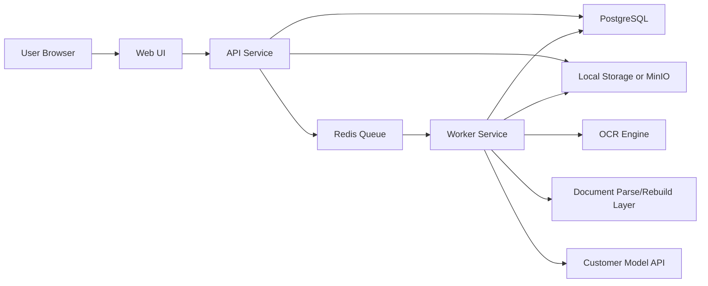

# Private Deployment Document Translator Plan

## Document Purpose

This document defines the implementation plan for a single-tenant, privately deployed document translation system for small companies.

It is written for coding agents and human collaborators who will build the product inside this repository.

The goal is to deliver a practical MVP that can be installed in a customer's environment, keeps files inside the customer's network, and uses customer-provided model APIs.

## Product Definition

We are building a private deployment document translation system with these default characteristics:

- Single-tenant deployment per customer
- Application, database, queue, and file storage run inside the customer's environment
- Original and translated files remain in the customer's network
- Model calls use customer-provided API credentials and endpoints
- MVP focuses on document translation, not a public SaaS website

## Non-Negotiable Constraints

These constraints must remain true unless explicitly changed by the user.

1. The system must support private deployment using customer-controlled infrastructure.
2. Original files and translated result files must not be uploaded to vendor-controlled storage.
3. The system must support customer-provided model APIs through configuration.
4. The system must be operable by a small company with modest infrastructure and low ops overhead.
5. The first release must optimize for reliable deployment and predictable behavior, not marketing features.

## Important Boundary Clarification

The phrase "files do not leave the intranet" does not automatically mean "text never leaves the intranet."

- If the customer points the system to an external model API, extracted text segments will be sent to that API for translation.
- If the customer requires that document content never leave the network, then the model endpoint must also be private and reachable inside the same trusted network boundary.

This distinction must be documented clearly in product copy, admin settings, and deployment docs.

## Target Customer

Small companies that:

- Need internal or client-facing document translation
- Care about private deployment more than consumer-grade polish
- Prefer simple installation over complex cloud-native operations
- Want to use their own model provider, API gateway, or internal model service

## MVP Scope

### In Scope

- User login for local deployment
- Admin and standard user roles
- Document upload
- Asynchronous translation jobs
- Translation progress and job status
- Result download
- PDF translation
- DOCX translation
- OCR for scanned PDFs
- Configurable source and target languages
- Customer-provided OpenAI-compatible model API configuration
- Local or intranet object storage
- Audit logs
- Configurable file retention and cleanup
- Docker Compose deployment

### Out of Scope for MVP

- Public marketing website
- Payments, billing, subscriptions, or license storefront
- Multi-tenant SaaS
- Public API product
- PPTX, XLSX, EPUB, image-only translation pipelines
- Video or manga translation
- Real-time collaborative editing
- Human post-editing workspace
- SSO, LDAP, SAML, or enterprise IAM integrations
- Kubernetes-first deployment

## Primary User Roles

### Admin

- Configure model endpoint, API key, and default model
- Configure storage paths and retention days
- Manage users
- Review system health and audit logs
- Retry or cancel failed jobs

### Standard User

- Upload supported documents
- Choose source and target languages
- Start translation jobs
- Track progress
- Download translated results

## Core User Flows

### Translation Flow

1. User uploads a PDF or DOCX file.
2. API validates file type, size, and permissions.
3. File is stored in local/intranet storage.
4. A translation job is created in the database and queued.
5. Worker performs document parsing.
6. If needed, worker runs OCR on scanned pages.
7. Worker segments translatable content.
8. Worker sends text segments to the configured model API.
9. Worker rebuilds the translated document.
10. Result file is stored locally.
11. Job status is updated and the user can download the result.

### Admin Configuration Flow

1. Admin opens settings.
2. Admin sets `MODEL_BASE_URL`, `MODEL_API_KEY`, and default `MODEL_NAME`.
3. Admin configures storage location, retention policy, and concurrency.
4. Admin runs a connection test.
5. Admin saves settings and the system records an audit event.

## Architecture



## Recommended Technical Stack

The repository is empty, so we can choose a stack intentionally.

### Backend

- Python 3.12+
- FastAPI for HTTP API
- SQLAlchemy + Alembic
- Pydantic for config and schemas
- RQ or Celery for background jobs

### Data Layer

- PostgreSQL for users, jobs, config, and audit logs
- Redis for queueing, retries, and short-lived state

### Storage

- Local filesystem for simplest deployments
- Optional MinIO for intranet object storage

### OCR and Document Processing

- OCR: PaddleOCR or another local OCR engine
- PDF handling: `pymupdf`, `pypdf`, `pdfplumber`, or a selected pipeline after evaluation
- DOCX handling: `python-docx` for initial support, with careful preservation tradeoffs

### Frontend

- Next.js or a lightweight React-based admin/app UI
- Keep UI minimal and operationally focused

### Deployment

- Docker Compose as the default deployment target
- Separate services for `web`, `api`, `worker`, `postgres`, `redis`

## Design Principles

1. Prefer clear system boundaries over premature abstraction.
2. Build for deployment simplicity first.
3. Keep model integration pluggable through configuration, not through many hard-coded vendors.
4. Preserve privacy and auditability as product features, not afterthoughts.
5. Keep the MVP narrow enough to finish.

## Security and Privacy Requirements

### Required

- HTTPS support behind customer reverse proxy
- Role-based access control
- Password hashing
- Audit log for uploads, downloads, deletes, config changes, and model test calls
- File retention policy with scheduled cleanup
- Secrets loaded from environment variables or customer-provided secret store

### Recommended for MVP

- Disable outbound network except configured model endpoint
- Signed download URLs or authenticated file download endpoints
- Request size limits
- Antivirus hook point for future file scanning

### Explicit Privacy Statements We Must Support

- Files are stored only in customer-controlled storage
- Files are deleted according to configured retention policy
- Model traffic goes only to the endpoint configured by the customer
- If the configured model endpoint is external, translated content is sent there by design

## Repository Shape

The following structure is recommended for the first implementation:

```text
doc-translator/
  plan.md
  docker-compose.yml
  .env.example
  README.md
  docs/
    architecture.md
    deployment.md
    operations.md
  apps/
    web/
    api/
    worker/
  packages/
    shared/
  infra/
    docker/
    scripts/
  tests/
```

If the project remains small, `packages/shared` can be omitted. Do not add extra packages unless they clearly reduce complexity.

## Configuration Model

At minimum, the system should support these environment variables:

```env
APP_ENV=production
APP_BASE_URL=http://localhost:3000

POSTGRES_URL=postgresql://...
REDIS_URL=redis://...

STORAGE_MODE=local
LOCAL_STORAGE_PATH=/data/files
FILE_RETENTION_DAYS=7

MODEL_BASE_URL=https://customer-model-gateway.example.com/v1
MODEL_API_KEY=replace-me
MODEL_NAME=gpt-4.1-mini
MODEL_TIMEOUT_SECONDS=120

OCR_ENABLED=true
OCR_LANGUAGE_HINT=auto

MAX_UPLOAD_MB=100
MAX_CONCURRENT_JOBS=2
```

## Domain Model

These entities should exist early in the design:

- `User`
- `Role`
- `TranslationJob`
- `JobFile`
- `JobEvent`
- `SystemSetting`
- `AuditLog`

### TranslationJob Suggested Fields

- `id`
- `created_by`
- `status`
- `source_language`
- `target_language`
- `input_file_id`
- `output_file_id`
- `model_base_url_snapshot`
- `model_name_snapshot`
- `error_message`
- `page_count`
- `created_at`
- `started_at`
- `completed_at`

## Job Lifecycle

Suggested statuses:

- `uploaded`
- `queued`
- `parsing`
- `ocr_running`
- `translating`
- `rebuilding`
- `completed`
- `failed`
- `cancelled`

The UI and API should expose these states consistently.

## MVP Quality Targets

### Functional

- User can upload supported files and receive a translated download
- Failed jobs can be diagnosed from logs and job events
- Admin can change model endpoint without code changes
- Files are cleaned up automatically after retention expiry

### Operational

- New deployment is possible with Docker Compose and documented env vars
- Basic health endpoints exist for API and worker
- Logs are readable and correlated by job ID

### Product

- A small company admin can understand setup without developer assistance beyond documentation
- The system behavior is predictable when the model API is slow, unavailable, or returns invalid output

## Implementation Phases

### Phase 0: Foundation

Goal:
Establish repository structure, deployment skeleton, and technical baseline.

Tasks:

- Create repo structure
- Add `docker-compose.yml`
- Add `.env.example`
- Add basic README
- Set up API app shell
- Set up worker app shell
- Set up web app shell
- Add PostgreSQL and Redis service definitions

Exit Criteria:

- `docker compose up` starts all baseline services
- Health endpoints return success
- No translation logic required yet

### Phase 1: Authentication and Admin Settings

Goal:
Create a usable private system with login and configuration management.

Tasks:

- Add local auth
- Add admin and standard roles
- Add settings page
- Store model and storage configuration
- Record audit logs for config changes

Exit Criteria:

- Admin can log in
- Admin can save model endpoint settings
- Settings persist in database

### Phase 2: File Upload and Job Queue

Goal:
Support document intake and asynchronous processing.

Tasks:

- Add upload UI and upload API
- Validate file type and size
- Store files locally
- Create translation jobs
- Queue background jobs
- Add job list and job detail pages

Exit Criteria:

- User can upload a PDF or DOCX
- Job appears in queue and status is visible

### Phase 3: Translation Pipeline

Goal:
Implement the core document translation workflow.

Tasks:

- Parse PDF and DOCX content
- Detect scanned PDFs
- Run OCR when needed
- Chunk text for model translation
- Call customer-provided OpenAI-compatible API
- Rebuild translated output
- Save result file
- Capture detailed job events

Exit Criteria:

- End-to-end translation works for representative PDF and DOCX samples
- Failures are surfaced with useful error context

### Phase 4: Admin Controls and Retention

Goal:
Make the system safe to operate in a customer environment.

Tasks:

- Add retention cleanup scheduler
- Add job retry and cancel controls
- Add audit log page
- Add storage usage summary
- Add model connection test

Exit Criteria:

- Expired files are deleted automatically
- Admin can inspect job history and key events

### Phase 5: Deployment and Hardening

Goal:
Make the MVP installable and supportable.

Tasks:

- Write deployment docs
- Add backup/restore guidance
- Add structured logs
- Add request and upload limits
- Add operational troubleshooting notes

Exit Criteria:

- A new environment can be deployed from docs
- Common failures have documented recovery steps

## Agent Execution Rules

When implementing from this plan, agents should follow these rules:

1. Do not build out-of-scope features unless explicitly requested.
2. Prefer repository-cohesive code over speculative abstractions.
3. Keep vendor/model integrations behind a small configuration-driven adapter layer.
4. Implement one vertical slice at a time so the system stays runnable.
5. Before adding a new dependency, verify that the current stack does not already cover the need.
6. Treat audit logging, retention, and deployment docs as part of the product, not cleanup work.
7. Do not assume "private deployment" means "offline inference"; preserve the boundary clarification in code and docs.

## Initial Backlog

This is the recommended build order once coding starts:

1. Scaffold repo and Docker Compose
2. Create API health endpoint and config loading
3. Add database models and migrations
4. Add local auth and role checks
5. Add admin settings UI and API
6. Add upload endpoint and file persistence
7. Add job queue and worker loop
8. Add PDF translation path
9. Add DOCX translation path
10. Add OCR path for scanned PDFs
11. Add audit log pages and retention cleanup
12. Add deployment and operations docs

## Risks and Unknowns

### Highest Risk

- Format preservation quality for complex PDFs
- DOCX reconstruction quality
- OCR accuracy on low-quality scans
- Latency and rate limits from customer-provided model APIs
- Variation in customer infrastructure and network policy

### Mitigation Strategy

- Keep supported formats narrow in MVP
- Save intermediate job events for diagnosis
- Design clear fallback behavior when translation or rebuild partially fails
- Test with a small curated sample set before expanding format support

## Definition of Done for MVP

The MVP is done when all statements below are true:

- The system can be deployed with Docker Compose in a customer-controlled environment
- Admin can configure a customer-provided model endpoint without code changes
- A standard user can upload PDF and DOCX files and receive translated outputs
- Scanned PDFs can go through OCR before translation
- Files are stored only in customer-controlled storage
- Retention cleanup deletes expired files automatically
- Admin can inspect audit logs and job history
- Core setup and operations are documented

## Next Step After This Plan

After this document is accepted, implementation should begin with Phase 0 and produce the repository skeleton plus deployment baseline before any deep document translation logic is added.
